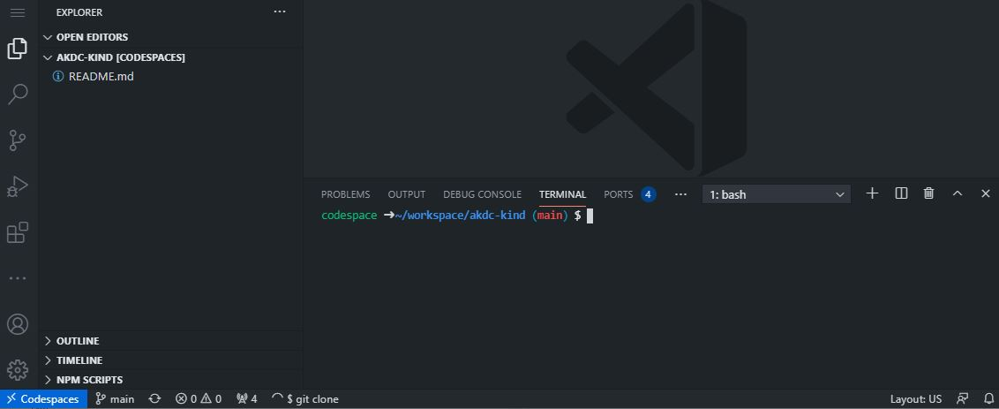

# Kind Dev Cluster on Codespaces

This will setup a Kubernetes developer cluster using `Kind` and `GitHub Codespaces`

## Setup

### Open with Codespaces

- Click the `Code` button on this repo
- Click `Open with Codespaces`
- Click `New Codespace`

### Build and Deploy Cluster

- From the Codespaces terminal
  - `make all`

### View Grafana Dashboard

- Once `make all` completes successfully
  - Click on the `ports` tab of the terminal window
  - Click on the `world icon` on the Grafana port (32000)

### Login to Grafana

- This will open a separate browser window with the Grafana dashboard
  - admin
  - Ngsa512

- Click on `Home` at the top of the page
- From the dashboards page, click on `NGSA`

