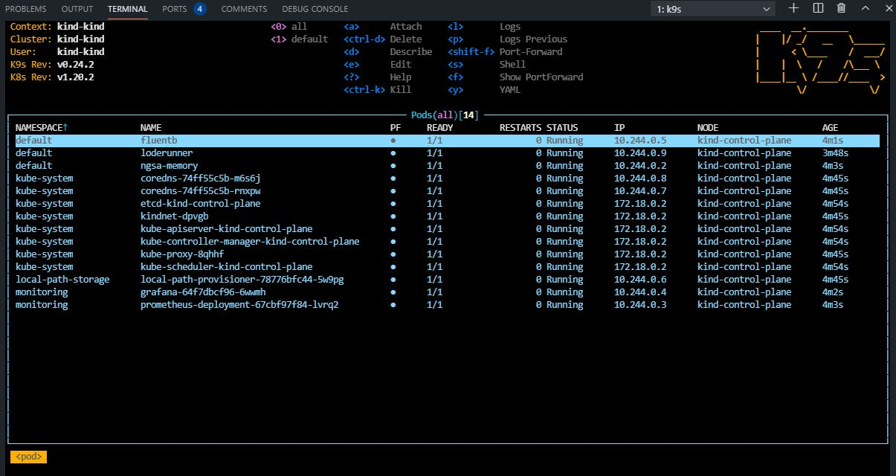

# Kind Dev Cluster on Codespaces

This will setup a Kubernetes developer cluster using `Kind` and `GitHub Codespaces`


## Setup

### Open with Codespaces

- Click the `Code` button on this repo
- Click `Open with Codespaces`
- Click `New Codespace`


### Open Workspace

- Click on the `hamburger` menu in upper left
- Choose `File`
- Choose `Open workspace`
- Click on `..` in selector
- Click on `akdc.code-workspace`

### Build and Deploy Cluster

- From the Codespaces terminal
  - `make all`


### Validate Deployment

Output from `make all` should resemble this

```text

default              fluentb                                      1/1     Running   0          31s
default              loderunner                                   1/1     Running   0          31s
default              ngsa-memory                                  1/1     Running   0          33s
monitoring           grafana-64f7dbcf96-cfmtd                     1/1     Running   0          32s
monitoring           prometheus-deployment-67cbf97f84-tjxm7       1/1     Running   0          32s

```

### Validate deployment with k9s

- From the Codespace terminal window, start `k9s`
  - Type `k9s` and press enter

> TODO - add k9s instructions

- Press `0` to select all namespaces



### Service endpoints

- All endpoints are usable in your browser via clicking on the `Ports (4)` tab
  - Select the `open in browser icon` on the far right
- Some popup blockers block the new browser tab
- If you get a gateway error, just hit refresh - it will clear once the port-forward is ready

```bash

# NGSA-App

# swagger
http localhost:30080

# version, metrics health
http localhost:30080/version
http localhost:30080/metrics
http localhost:30080/healthz
http localhost:30080/healthz/ietf

# actors API
http localhost:30080/api/actors
http localhost:30080/api/actors/nm0000206
http localhost:30080/api/actors?q=keanu

# genres api
http localhost:30080/api/genres

# movies api
http localhost:30080/api/movies
http localhost:30080/api/movies/tt0133093
http localhost:30080/api/movies?q=matrix
http localhost:30080/api/movies?genre=action
http localhost:30080/api/movies?year=1999
http localhost:30080/api/movies?rating=8.0

# LodeRunner
# note the / url will fail by design
http localhost:30088/version
http localhost:30088/metrics

# Prometheus
http localhost:30000

# Grafana
http localhost:32000

```

### View Grafana Dashboard

> You will need the information in the next section to login / use Grafana

- Once `make all` completes successfully
  - Click on the `ports` tab of the terminal window
  - Click on the `open in browser icon` on the Grafana port (32000)
  - This will open Grafana in a new browser tab


### Login to Grafana

- From the Grafana dashboard
  - admin
  - Ngsa512

- Click on `Home` at the top of the page
- From the dashboards page, click on `NGSA`


### Run a local test

```bash

# from Codespaces terminal

# change to the loderunner repo
cd ../loderunner

# run a complete test
dotnet run -- -s http://localhost:30080 -f benchmark.json

# run a baseline test
# this test will generate errors in the grafana dashboard by design

dotnet run -- -s http://localhost:30080 -f baseline.json

```

- Switch to the Grafana brower tab
- The test will generate 400 / 404 results
- The requests metric will go from green to yellow to red as load increases
  - It may skip yellow
- As the test completes
  - The metric will go back to green (1.0)
  - The request graph will return to normal

### View Prometheus Dashboard

- Click on the `ports` tab of the terminal window
- Click on the `open in browser icon` on the Prometheus port (30000)
- This will open Prometheus in a new browser tab

- From the Prometheus tab
  - Begin typing NgsaAppDuration_bucket in the `Expression` search
  - Click `Execute`
  - This will display the `histogram` that Grafana uses for the charts

### View Fluent Bit Logs

- Start `k9s` from the Codespace terminal
- Select `fluentb` and press `enter`
- Press `enter` again to see the logs
- Press `s` to Toggle AutoScroll
- Press `w` to Toggle Wrap
- Review logs that will be sent to Log Analytics when configured

### Build and deploy a local version of LodeRunner

- Switch back to your Codespaces tab

```bash

# from Codespaces terminal

# check the current verion of LodeRunner
http localhost:30088/version

# make and deploy a local version of LodeRunner to k8s
make loderunner

# check the new verion of LodeRunner
http localhost:30088/version

```

### Build and deploy a local version of ngsa-memory

- Switch back to your Codespaces tab

```bash

# from Codespaces terminal

# check the current verion of ngsa-memory
http localhost:30080/version

# make and deploy a local version of ngsa-memory to k8s
make app

# check the new verion of ngsa-memory
http localhost:30080/version

```

## Next Steps

> `Makefile` is a good place to start exporing
